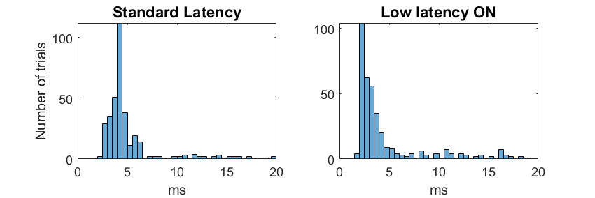

SpikeGLX-MATLAB-SDK
===================

### What

The SDK lets MATLAB (Windows and Linux) applications communicate with
SpikeGLX versions 20220101 and later:

* Set/get parameters.
* Start/Stop runs.
* Start/stop writing.
* Fetch data in real time.
* Everything you need to integrate SpikeGLX into your workflow.

There's an included closed-loop latency test program; used to obtain these
results on an i7-8850H, 2.6 GHz laptop:

>*Note: Low latency mode is available with SpikeGLX 20230815 and later.*

### Who

The SDK is developed by [Bill Karsh](https://www.janelia.org/people/bill-karsh)
of the [Tim Harris Lab](https://www.janelia.org/lab/harris-lab-apig) at
HHMI/Janelia Research Campus.

### Precompiled Components

Everything you need is included in the package and precompiled. You would
only need to compile yourself if you need to use a very old MATLAB version.

### Building in Linux

I build using Linux MATLAB R2021b.

### Building in Windows

I build using MS Visual Studio C++ 2015, and MATLAB R2018b.

### Licensing

Use is subject to Janelia Research Campus Software license terms:
[http://license.janelia.org/license](http://license.janelia.org/license).

_fin_

